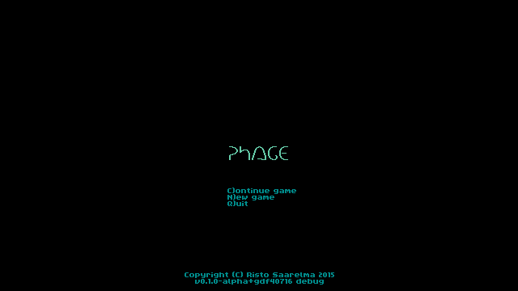

PHAGE -- 2015 7DRL roguelike

Build instructions
------------------

Phage should build with a stable 1.x version of the Rust compiler. It was last
tested with version 1.13. You need to install the Rust programming language,
either from [the Rust website](https://www.rust-lang.org/en-US/downloads.html)
or from the package manager of your operating system.

If you're on Windows, you will also need to have MinGW GCC installed and in
your command line path to be able to build the third-party dependencies.

With rustc in your path, just go to the Phage directory and type

    cargo run

for a faster-compiling debug build or

    cargo run --release

for the release build.

Screenshots
-----------

